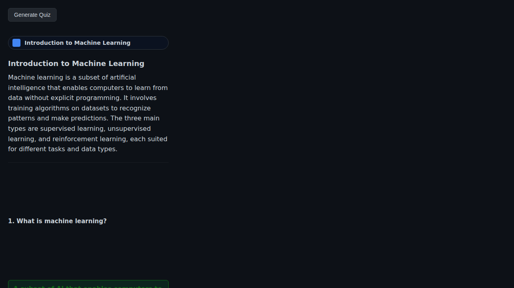
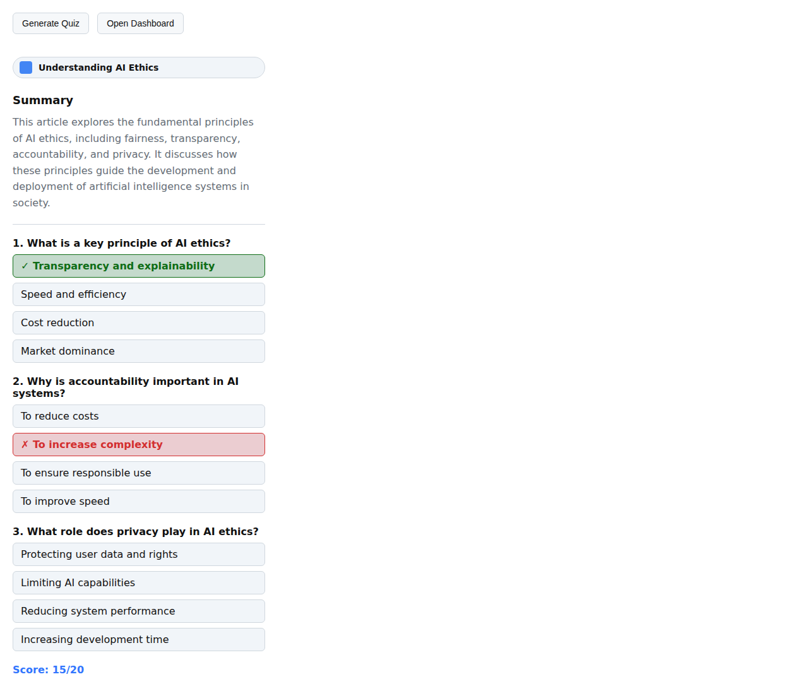
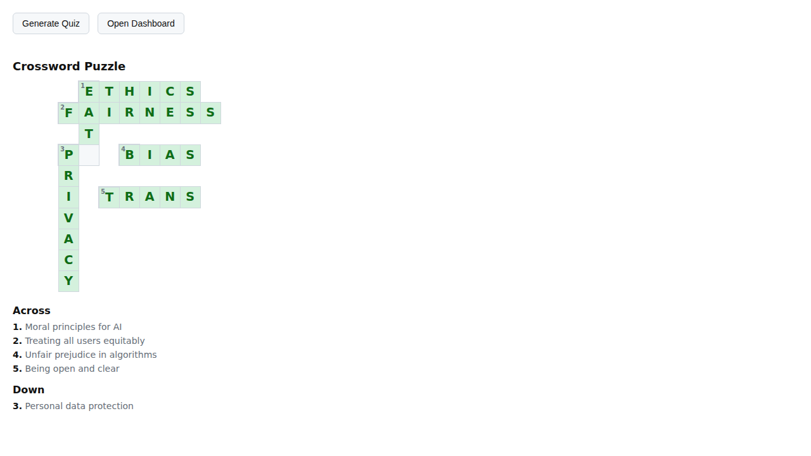
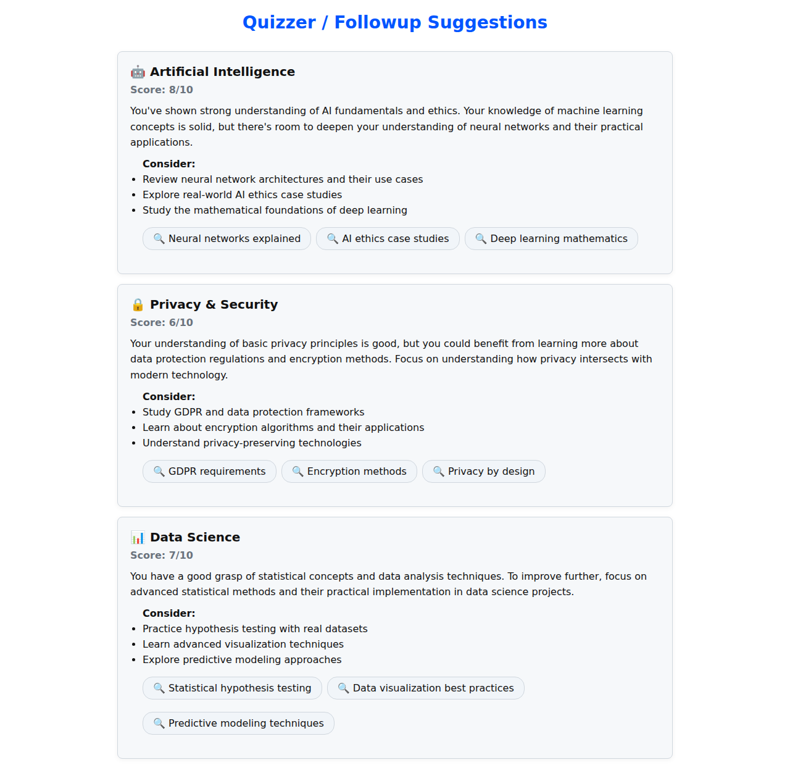

<p align="center">
  
</p>

# Chrome Quizzer

A Chrome extension that automatically generates comprehension quizzes from any article using on-device AI. No internet required for AI processing—everything runs locally in your browser!

<p align="center">
  
  
</p>
<p align="center"><em>Side panel with quiz, crossword, and hangman features in light and dark mode</em></p>

## 📸 Feature Screenshots

<table>
  <tr>
    <td align="center">
      <br/>
      <em>Interactive Quiz with Instant Feedback</em>
    </td>
    <td align="center">
      <br/>
      <em>AI-Generated Crossword Puzzle</em>
    </td>
  </tr>
  <tr>
    <td align="center">
      <br/>
      <em>Hangman Word Game</em>
    </td>
    <td align="center">
      <br/>
      <em>Personalized Learning Dashboard</em>
    </td>
  </tr>
  <tr>
    <td align="center" colspan="2">
      <br/>
      <em>Create Flashcards from Selected Text with AI-Generated Summaries</em>
    </td>
  </tr>
</table>

## ✨ Features

- **📖 Smart Article Extraction** - Automatically extracts main content from web pages using Mozilla's Readability library
- **🌐 Automatic Language Detection & Translation** - Detects article language and translates non-English content to English for consistent AI processing
- **🤖 On-Device AI** - Leverages Chrome's built-in AI APIs (no external API keys or internet required for AI)
  - AI Summarizer for concise article summaries
  - Language Model for quiz generation, crossword puzzles, flashcards, and personalized suggestions
  - Language Detector for identifying article language
  - Translator for automatic translation to English
- **📝 Interactive Quizzes** - Generates 20 multiple-choice questions based on article content
- **✅ Instant Feedback** - Click answers to see if you're correct with visual feedback
- **🧩 Crossword Puzzles** - AI-generated crossword puzzles from article content with interactive grid interface
- **🎯 Hangman Game** - Word-guessing game using vocabulary from the article's crossword
- **🃏 Flashcards** - Create AI-powered flashcards from any selected text on web pages
  - Right-click selected text and choose "Quizzer: Add Flashcard"
  - AI generates title, summary, and preserves the original text extract
  - Cards displayed in side panel with delete option
  - Syncs automatically across the extension
- **📊 Learning Dashboard** - Personalized learning suggestions based on your quiz performance
  - Tracks answer history to identify knowledge gaps
  - Generates follow-up search suggestions
  - Provides category-specific recommendations
- **🔍 Omnibox Integration** - Quick access to dashboard by typing "quizzer" in the address bar
- **🔔 Smart Notifications** - Periodic updates with refreshed learning suggestions
- **🌓 Dark Mode Support** - Automatic theme switching based on system preferences
- **🎨 Modern UI** - Clean, GitHub-inspired design with smooth animations
- **🔒 Privacy-First** - All AI processing happens on your device

## 🚀 Requirements

- **Chrome 129+** with AI features enabled
- Enable Chrome's AI features:
  1. Navigate to `chrome://flags/#optimization-guide-on-device-model`
  2. Set to "Enabled BypassPerfRequirement"
  3. Navigate to `chrome://flags/#prompt-api-for-gemini-nano`
  4. Set to "Enabled"
  5. Restart Chrome
  6. Confirm AI models are available at `chrome://components/` (look for "Optimization Guide On Device Model")

## 📥 Installation

### From Source

1. Clone this repository:
   ```bash
   git clone https://github.com/edvilme/chrome-quizzer.git
   cd chrome-quizzer
   ```

2. Install dependencies and build:
   ```bash
   npm install
   npm run build
   ```

3. Load the extension in Chrome:
   - Open `chrome://extensions` in Chrome
   - Enable "Developer mode" (top-right toggle)
   - Click "Load unpacked"
   - Select the `chrome-quizzer` folder

4. The extension icon will appear in your toolbar. Click it to open the side panel!

## 🎯 Usage

### Side Panel Features

1. **Navigate to any article** on the web (blog posts, news articles, documentation, etc.) in any language
2. **Click the Chrome Quizzer icon** in your toolbar to open the side panel
3. **Wait for processing** - The extension will:
   - Extract the article content
   - Detect the article's language (displayed in the UI)
   - Automatically translate non-English content to English
   - Generate a summary
   - Create 20 quiz questions
   - Generate a crossword puzzle
   - Create a hangman game
4. **Take the quiz** - Click on answers to test your comprehension
5. **Get instant feedback** - Correct answers turn green, incorrect ones turn red
6. **Play crossword** - Fill in the interactive crossword puzzle based on article content
7. **Play hangman** - Guess letters to reveal words from the article

### Creating Flashcards

1. **Select any text** on a webpage that you want to remember
2. **Right-click** the selected text
3. **Choose "Quizzer: Add Flashcard"** from the context menu
4. **Wait for AI processing** - The extension will generate a flashcard with:
   - An AI-generated title
   - A concise summary of the content
   - The original selected text as a quote
5. **View your flashcards** in the side panel at the top
6. **Delete flashcards** by clicking the × button on any card

### Learning Dashboard

1. **Access the dashboard** by:
   - Clicking "Open Dashboard" button in the side panel, or
   - Typing `quizzer` in Chrome's address bar (omnibox) and pressing Enter
2. **View personalized suggestions** based on your quiz performance
3. **Click follow-up searches** to explore topics where you need improvement
4. **Track your progress** across different knowledge categories

Your quiz answers are tracked locally to provide personalized learning suggestions. The extension periodically refreshes suggestions and sends notifications with updates.

## 🛠️ Development

### Project Structure

```
chrome-quizzer/
├── assets/           # Extension icons and screenshots
├── schemas/          # JSON schemas for AI responses
│   ├── quiz-schema.json
│   ├── crossword-schema.json
│   ├── dashboard-category-schema.json
│   └── answer-schema.json
├── src/              # Source code
│   ├── service_worker.js      # Background script (AI processing)
│   ├── LanguageModel.js       # Quiz, crossword, flashcard, and suggestion generation
│   ├── Summarizer.js          # Article summarization
│   ├── TabExtractor.js        # Content extraction
│   ├── LanguageDetector.js    # Language detection
│   └── ModelAcquisition.js    # AI model management
├── static/           # UI components
│   ├── sidepanel/             # Side panel UI
│   ├── dashboard/             # Learning dashboard
│   ├── QuestionComponent/     # Quiz question component
│   ├── CrossWordComponent/    # Crossword puzzle component
│   ├── HangmanComponent/      # Hangman game component
│   └── FlashCardComponent/    # Flashcard component
├── manifest.json     # Extension configuration
└── package.json      # Dependencies
```

### Building

```bash
npm run build
```

This bundles the service worker with esbuild, including all dependencies.

### Debugging

- **Service Worker**: Check `chrome://serviceworker-internals` or the extensions page for console logs
- **Side Panel**: Right-click the side panel → "Inspect" to open DevTools

## 🔧 Technologies Used

- **Chrome Extension APIs**: Manifest V3, Side Panel API, Scripting API, Omnibox API, Notifications API, Storage API, Search API, Context Menus API
- **Chrome AI APIs**: Built-in Language Model, Summarizer, Language Detector, and Translator
- **Mozilla Readability**: Article content extraction
- **linkedom**: Server-side DOM parsing
- **crossword-layout-generator**: Crossword puzzle layout generation
- **esbuild**: Fast bundling

## 📄 License

This project is licensed under the MIT License - see the [LICENSE](LICENSE) file for details.

## 🤝 Contributing

Contributions are welcome! Feel free to open issues or submit pull requests.

## ⚠️ Known Limitations

- Only works on pages with readable article content
- Requires Chrome's experimental AI features to be enabled
- AI models need to be downloaded on first use (may take a few minutes)
- Quiz quality depends on article content and AI model capabilities
- Non-English articles are automatically translated to English, which may affect nuance and context in quiz generation
